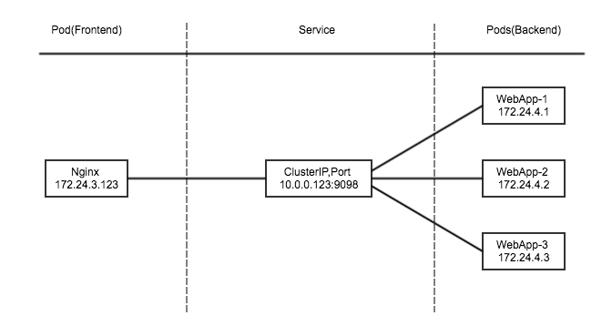

## Service
Pod的IP是动态分配在**docker0**所在网段的,当发生重启，扩容等操作时，IP地址会随之变化。当某个Pod(frontend)需要去访问其依赖的另外一组Pod(backend)时，如果backend的IP发生变化时，如何保证fronted到backend的正常通信变的非常重要。为了解决此类问题,Kubernetes设计了Service的概念。

这里docker0是一个网桥，docker daemon启动container时会根据docker0的网段来划粉container的IP地址[Docker网络](https://docs.docker.com/engine/userguide/networking/dockernetworks/)


在实际生产环境中，对Service的访问可能会有两种来源：Kubernetes集群内部的程序（Pod）和Kubernetes集群外部，为了满足上述的场景，Kubernetes service有以下三种类型：

* **ClusterIP**:提供一个集群内部的虚拟IP以供Pod访问。
* **NodePort**:在每个Node上打开一个端口以供外部访问。
* **LoadBalancer**:通过外部的负载均衡器来访问。

### ClusterIP && NodePort && LoadBalancer
#### 1. ClusterIP
此模式会提供一个集群内部的虚拟IP（与Pod不在同一网段)，以供集群内部的pod之间通信使用。
ClusterIP也是Kubernetes service的默认类型。



为了实现图上的功能主要需要以下几个组件的协同工作

* **apiserver** 用户通过kubectl命令向apiserver发送创建service的命令，apiserver接收到请求以后将数据存储到etcd中。
* **kube-proxy** kubernetes的每个节点中都有一个叫做kube-proxy的进程，这个进程负责感知service，pod的变化，并将变化的信息写入本地的iptables中。
* **iptables** 使用NAT等技术将virtualIP的流量转至endpoint中。

下面我们实际发布一个Service，能够更清晰的了解到Service是如何工作的。

##### 1.1 发布一个rc，并指定replices count为3.

```
yancey@ yancey-macbook kubernetes-1$kubectl create -f rc_nginx.yaml
yancey@ yancey-macbook kubernetes-1$kubectl get pods
NAME                     READY     STATUS    RESTARTS   AGE
k8s-master-core-v2-01    4/4       Running   0          8m
k8s-proxy-core-v2-01     1/1       Running   0          8m
nginx-controller-6bovu   1/1       Running   0          4m
nginx-controller-iowux   1/1       Running   0          4m
nginx-controller-o7m6u   1/1       Running   0          4m
yancey@ yancey-macbook kubernetes-1$kubectl describe pod nginx-controller-6bovu
Name:		nginx-controller-6bovu
Namespace:	default
Node:		core-v2-01/172.17.8.101
Start Time:	Fri, 17 Jun 2016 15:22:20 +0800
Labels:		app=nginx
Status:		Running
IP:		10.1.13.3
Controllers:	ReplicationController/nginx-controller
```

##### 1.2. 发布一个service，并指定步骤1中的label。

```
yancey@ yancey-macbook kubernetes-1$kubectl create -f service_nginx.yaml
yancey@ yancey-macbook kubernetes-1$kubectl get svc
NAME            CLUSTER-IP   EXTERNAL-IP   PORT(S)    AGE
kubernetes      10.0.0.1     <none>        443/TCP    9m
nginx-service   10.0.0.252   <none>        8000/TCP   4m
```
kubernetes为nginx-server这个service创建了一个10.0.0.252这个ClusterIP，也可以称为VirtualIP.

```
yancey@ yancey-macbook kubernetes-1$kubectl get ep
NAME            ENDPOINTS                                AGE
kubernetes      172.17.8.101:6443                        9m
nginx-service   10.1.13.2:80,10.1.13.3:80,10.1.13.4:80   4m
```
查看endpoint信息，发现nginx-service一共有三个endpoint地址，分别对应nginx的三个pod。

##### 1.3. 查看iptables，观察其NAT表中的信息（只截取了部分和这个service有关的信息）
查看iptables中NAT表的命令:```iptables -L -v -n -t nat```

```
Chain PREROUTING (policy ACCEPT 0 packets, 0 bytes)
 pkts bytes target     prot opt in     out     source               destination
   37  2766 KUBE-SERVICES  all  --  *      *       0.0.0.0/0            0.0.0.0/0            /* kubernetes service portals */
   33  2112 DOCKER     all  --  *      *       0.0.0.0/0            0.0.0.0/0            ADDRTYPE match dst-type LOCAL
```
在PREROUTING链中会先匹配到KUBE-SERVICES这个Chain。

```
Chain KUBE-SERVICES (2 references)
 pkts bytes target     prot opt in     out     source               destination
    0     0 KUBE-SVC-GKN7Y2BSGW4NJTYL  tcp  --  *      *       0.0.0.0/0            10.0.0.252           /* default/nginx-service: cluster IP */ tcp dpt:8000
   18  1080 KUBE-NODEPORTS  all  --  *      *       0.0.0.0/0            0.0.0.0/0            /* kubernetes service nodeports; NOTE: this must be the last rule in this chain */ ADDRTYPE match dst-type LOCAL

```

所有destinationIP为10.0.0.252的包都转到**KUBE-SVC-GKN7Y2BSGW4NJTYL**这个Chain

```
Chain KUBE-SVC-GKN7Y2BSGW4NJTYL (1 references)
 pkts bytes target     prot opt in     out     source               destination
    0     0 KUBE-SEP-7ROBBXFV7SD4AIRW  all  --  *      *       0.0.0.0/0            0.0.0.0/0            /* default/nginx-service: */ statistic mode random probability 0.33332999982
    0     0 KUBE-SEP-XY3F6VJIZ7ELIF4Z  all  --  *      *       0.0.0.0/0            0.0.0.0/0            /* default/nginx-service: */ statistic mode random probability 0.50000000000
    0     0 KUBE-SEP-JIDZHFC4A3T535AK  all  --  *      *       0.0.0.0/0            0.0.0.0/0            /* default/nginx-service: */
```
这里能看到请求会平均执行**KUBE-SEP-7ROBBXFV7SD4AIRW**,**KUBE-SEP-XY3F6VJIZ7ELIF4Z**,**KUBE-SEP-XY3F6VJIZ7ELIF4Z**这三个Chain.最后我们看下**KUBE-SEP-7ROBBXFV7SD4AIRW**这个Chain做了什么

```
Chain KUBE-SEP-7ROBBXFV7SD4AIRW (1 references)
 pkts bytes target     prot opt in     out     source               destination
    0     0 KUBE-MARK-MASQ  all  --  *      *       10.1.13.2            0.0.0.0/0            /* default/nginx-service: */
    0     0 DNAT       tcp  --  *      *       0.0.0.0/0            0.0.0.0/0            /* default/nginx-service: */ tcp to:10.1.13.2:80

```
这个Chain使用了DNAT规则将流量转发到10.1.13.2:80这个地址。至此从Pod发出来的流量通过本地的iptables将流量转至了service背后的pod上。
#### 2. NodePort
Kubernetes将会在每个Node上打开一个端口并且**每个Node的端口都是一样的**，通过\<NodeIP>:NodePort的方式Kubernetes集群外部的程序可以访问Service。

修改kubernetes/service_nginx.yaml，将Service的type改为NodePort类型。

```
apiVersion: v1
kind: Service
metadata:
  name: nginx-service
spec:
  type: NodePort
  ports:
  - port: 8000
    targetPort: 80
    protocol: TCP
  # just like the selector in the replication controller,
  # but this time it identifies the set of pods to load balance
  # traffic to.
  selector:
    app: nginx
```
发布这个service，可以看到已经随机分配了一个NodePort端口。

```
yancey@ yancey-macbook kubernetes-1$kubectl get svc nginx-service -o yaml
apiVersion: v1
kind: Service
metadata:
  creationTimestamp: 2016-06-18T03:29:42Z
  name: nginx-service
  namespace: default
  resourceVersion: "1405"
  selfLink: /api/v1/namespaces/default/services/nginx-service
  uid: e50ba23a-3504-11e6-a94f-080027a75e9e
spec:
  clusterIP: 10.0.0.229
  ports:
  - nodePort: 30802
    port: 8000
    protocol: TCP
    targetPort: 80
  selector:
    app: nginx
  sessionAffinity: None
  type: NodePort
status:
  loadBalancer: {}
```
观察Iptables中的变化，KUBE-NODEPORTS这个Chain中增加了如下内容

```
Chain KUBE-NODEPORTS (1 references)
 pkts bytes target     prot opt in     out     source               destination
    0     0 KUBE-MARK-MASQ  tcp  --  *      *       0.0.0.0/0            0.0.0.0/0            /* default/nginx-service: */ tcp dpt:30802
    0     0 KUBE-SVC-GKN7Y2BSGW4NJTYL  tcp  --  *      *       0.0.0.0/0            0.0.0.0/0            /* default/nginx-service: */ tcp dpt:30802
```

可以看到流量会转至KUBE-SVC-GKN7Y2BSGW4NJTYL这个Chain中处理一次，也就是ClusterIP中提到的通过负载均衡将流量平均分配到3个endpoint上。

#### 3. LoadBalancer
待补充。

### 服务发现
当发布一个服务之后，我们要使用这个服务，第一个问题就是要拿到这些服务的IP和PORT，kubernetes提供两种方式以便在程序中去动态的获取这些信息。

1. ENV环境变量
在Pod其中之后，kubernetes会将现有服务的IP，PORT以环境变量的方式写入pod中，程序只要读取这些环境变量即可。
2. DNS，程序中可以使用server的名称对服务进行访问，在程序启时候，不必预先读取环境变量中的内容。

这是两种方式的详细说明：[http://kubernetes.io/docs/user-guide/services/#discovering-services](http://kubernetes.io/docs/user-guide/services/#discovering-services)

###  附录
1. [iptables文档](https://access.redhat.com/documentation/en-US/Red_Hat_Enterprise_Linux/4/html/Security_Guide/s1-fireall-ipt-act.html#s2-firewall-policies)
2. [Debuging Service](http://kubernetes.io/docs/user-guide/debugging-services/)
